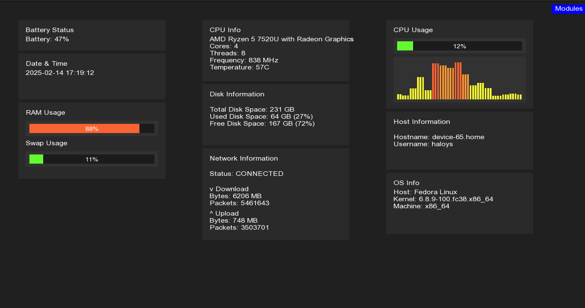
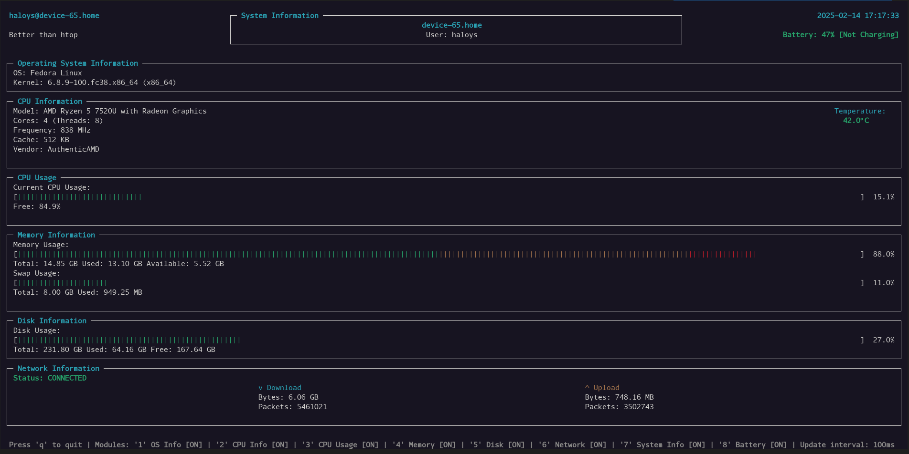

# MyGKrellm

*Project completed in 24 hours*

A system monitor software inspired by GKrellM, built in C++ with SFML and NCurses display modes. The program displays various system information modules in a stacked layout, allowing users to monitor system resources in either graphical or text mode.

## Overview

### SFML Display Mode


### NCurses Display Mode


## Features

- Dual display modes (SFML/NCurses)
- Modular architecture with runtime module management
- Real-time system monitoring
- Core system information modules:
    - Hostname/Username
    - OS/Kernel details
    - Date/Time
    - CPU usage and info
    - RAM usage
    - Battery usage
    - Disk usage
    - Network System

## Prerequisites

- SFML library
- NCurses library
- C++ compiler with C++17 support
- Make

### Installation

```bash
# On Ubuntu/Debian
sudo apt-get install libsfml-dev libncurses5-dev

# On Fedora
sudo dnf install SFML-devel ncurses-devel

# On Arch Linux
sudo pacman -S sfml ncurses
```

## Building

```bash
make
./MyGKrellm
```

## Usage

- Launch graphical mode: `./MyGKrellm sfml`
- Launch text mode: `./MyGKrellm ncurses`

## Team

<table>
  <tr>
    <td align="center">
      <a href="https://github.com/Haloys">
        <br />
        <sub><b>Aloys MANGIN</b></sub>
      </a><br />
      NCurses Implementation
    </td>
    <td align="center">
      <a href="https://github.com/flav-code">
        <br />
        <sub><b>Flavien DE RIGNÉ</b></sub>
      </a><br />
      SFML Implementation
    </td>
    <td align="center">
      <a href="https://github.com/maitrecraft1234">
        <br />
        <sub><b>Victor JURGENS-MESTRE</b></sub>
      </a><br />
      Module System
    </td>
  </tr>
</table>
